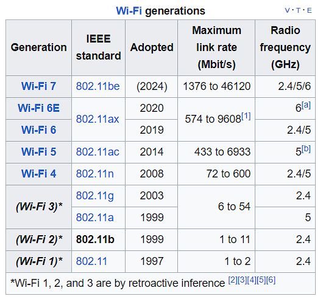

# Wifi basic tech specs

✍🏻Written/Revised : August 2023

|Table of contents|
|---|
|[Disclaimer](#disclaimer)|
|[General Ideas](#general-ideas)   - [Radio types](#1-radio-types)  - [Supported Bands](#2-supported-bands)  - [Channels](#3-channels)|
|[Conclusion](#conclusion)|
|[How to select a particular channel for your home setup?](#how-to-select-a-particular-channel-for-your-home-setup)|

### Disclaimer

These are things I have read and understood regarding the basics of a wireless router. This is by no means an educational content, but rather self notes I have taken. As such, many of the things below may be outdated.

If you want to start at the beginning, go read [this post](https://linustechtips.com/topic/1514548-router-not-working-as-expected) that i made for help in LTT Forum
 

## General Ideas

For a Wifi router/access-point, to understand its wireless connections, you need to know 3 things essentially

1. [Radio types](#1-radio-types)
2. [Supported Bands](#2-supported-bands)
3. [Channels](#3-channels)

___
### 1. Radio Types

Radio type refer to the IEEE Wireless network specifications (IEEE standards) that all routers abide by. '**IEEE 802.11**' is the general standard for all things WIFI [[1]](https://en.wikipedia.org/wiki/IEEE_802.11).
Under that, based on the Wifi generation and the supported bands, it is categorized into different standards.
Each of these standards, support different radio frequencies (Bands) - with 2.4GHz being the most common.‍

*Wi-Fi generations table*	[[2]](https://en.wikipedia.org/wiki/IEEE_802.11b-1999)

___

### 2. Supported Bands

Bands are the wireless frequency range that are supported by your router. It is generally written out loud in the packaging Eg: **Wifi6 Supported** or **Dual band supported** [[3]](https://amzn.eu/d/j5ByQaK).

Generally, there are 3 major frequency-ranges : 
- 2.4GHz
- 5GHz 
- 6GHz

i.e A *2.4GHz* band router supports signal range of 2401-2495MHz [[4]](https://en.wikipedia.org/wiki/List_of_WLAN_channels#2.4_GHz_(802.11b/g/n/ax)). 
*💭: what happened to 2400MHz and other unmarked frequencies?🤔*

To understand which all, your particular router supports (if you don't believe in the markings on the box), you can verify which all radio types your router supports and compare them with the generation table.

*💭 Analogy: Consider these bands as the whole wide road, then these roads must have lanes to maintain order and ease up the traffic. Thats where 'channels' come in*
___

### 3. Channels

**Note - For the sake of simplicity, for all following examples, i will be using the 2.4GHz band.**

Each wifi band constitutes a range of frequency. Eg: a 2.4GHz wifi band can support signals from 2412-2484MHz. 

For further convenience, performance and to reduce device congestion, this range is further divided into multiple channels. These channels have a particular width aka ***bandwidth*** - Eg: 2.4GHz band can have bandwidths of 20, 25 or 40MHz - thus forming up to 14 channels.[[4]](https://en.wikipedia.org/wiki/List_of_WLAN_channels#2.4_GHz_(802.11b/g/n/ax)) 

Due to this, some channels can overlap with each other in terms of the frequency they support. 

Keep in mind that for a given bandwidth, these channel numbers are specifically tied to a particular MHz frequency range - Eg: in 20MHz bandwidth, channel #1 will always be from 2402-2427MHz, so on and so forth. 

**Note - This is but a very basic explanation of what and how channels work. Do check the wikipedia page for extensive understanding and learning**
___

## Conclusion

You should be good to go with this head-start.

#### How to select a particular channel for your home setup? ########

In order to keep your wifi signals and connection, a bit more 'in lane', it is useful to select a particular channel for your home-wifi for your devices to connect on to (rather than '*Auto*' for many routers' default setting). 
You can determine if your wifi channel is cluttered using some wifi-analyzer apps.

Step 1:
	Understand what all standards your router supports. This will be mentioned in the router packaging or spec-sheet or router control webpage. (in a generic DLink routers, its given as 'Mode' in 'Wireless' tab). 
Step 2: 
	Select the band. This will generally  be under the bandwidth option. 
Step 3:
	Select which channel that you need your router to run 